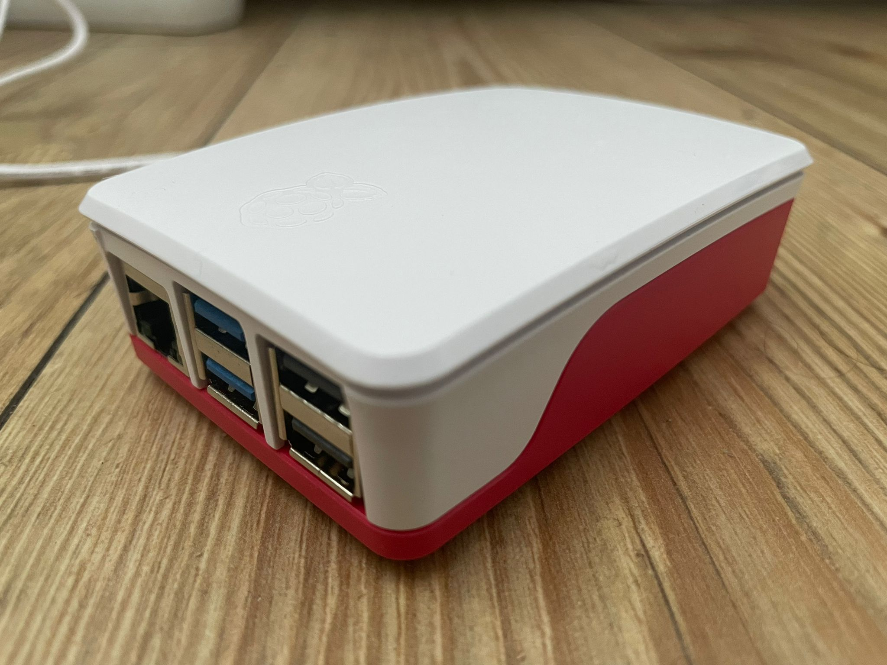

# Hello and welcome to my website

My name is Ivaylo Rusinov, currently a 2nd year MSc student at the University of Groningen and finishing up my Master's thesis that is done in colalboration with the Department of Nephrology at the University Medical Center Groningen. I am an aspiring data scientist and software engineer! Aside from my studies, I am a teaching assistant at the university for various courses, both at the Bachelor and the Master level. You can contact me through [Gmail](mailto:ivaylo.russinov@gmail.com), [LinkedIn](https://www.linkedin.com/in/ivaylo-rusinov-7002b2230/), or [GitHub](https://github.com/i4ata). This is my [CV](../../assets/home/cv.pdf).

This website is written using Plotly's [Dash](https://dash.plotly.com/) and is self-hosted on this bad boi (Raspberry Pi 5 (8GB)) at home:

It is funneled to the web using [Tailscale](https://tailscale.com/). The source code for the website is available on [GitHub](https://github.com/i4ata/test) as well as a [Docker image](https://hub.docker.com/r/i4ata/my_website).

The links at the top of this page redirect to some of my passion projects that I work on from time to time alongside my studies. The list is not complete at all, there are multiple very interesting projects still in the queue. Special attention is paid to ensure that the technicalities of each project are throroughly explained and the source code that runs in the backend is maximally efficient and concise. Although the general topics dicussed in the projects are technically already known to the world, the implementations, interactions, and explanations are 100% original. Let me know if you have some ideas on how to improve something!

The majority of the focus during the development of this website is in the quality of the projects and the interactions rather than the design. That is why everything looks so barebones, though there is some charm to it! It will definitely be a project for the future to make everything more modern and aesthetic.

 Tools that I use on a daily basis include:

- Anything Python
- Linux
- SQL
- Git
- Docker
- SLURM
- R

 My main techincal topics of interest in no particular order are:

- Data Science
- Machine Learning
- Deep Learning
- MLOps
- Mathematics
- Computer Vision
- Reinforcement Learning

 Full list of courses that I have been a teachin assistant for (no particular order):

| Course Name | Master (M) or Bachelor (B) | Academic Year(s) of Teaching |
|-------------|----------------------------|------------------------------|
| [Functional Programming](https://ocasys.rug.nl/current/catalog/course/WBCS002-05) | B | 2023-2024 & 2024-2025 |
| [Object-Oriented Programming](https://ocasys.rug.nl/current/catalog/course/WBAI045-05) | B | 2023-2024 & 2024-2025 |
| [Introduction to Machine Learning](https://ocasys.rug.nl/current/catalog/course/WBAI056-05) | B | 2023-2024 & 2024-2025 |
| [Pattern Recognition](https://ocasys.rug.nl/current/catalog/course/WMAI021-05) | M | 2024-2025 |
| [Reinforcement Learning Practical](https://ocasys.rug.nl/current/catalog/course/WBAI015-05) | B | 2024-2025 |
| [Unsupervised Deep Learning](https://ocasys.rug.nl/current/catalog/course/WMAI038-05) | M | 2024-2025 |
| [Deep Reinforcement Learning](https://ocasys.rug.nl/current/catalog/course/WMAI024-05) | M | 2024-2025 |
| [Data Science](https://ocasys.rug.nl/current/catalog/course/WBAI064-05) | B | 2024-2025 |
| [Collective Intelligence](https://ocasys.rug.nl/current/catalog/course/WMAI023-05) | M | 2024-2025 |

  Other certifications:

- BSc Artificial Intelligence at the University of Groningen, 2020-2024 (8.4/10)
- [Data Science (Software University of Bulgaria, 2022)](../../assets/home/Data%20Science%20-%20June%202022%20-%20Certificate.pdf) (6/6)
