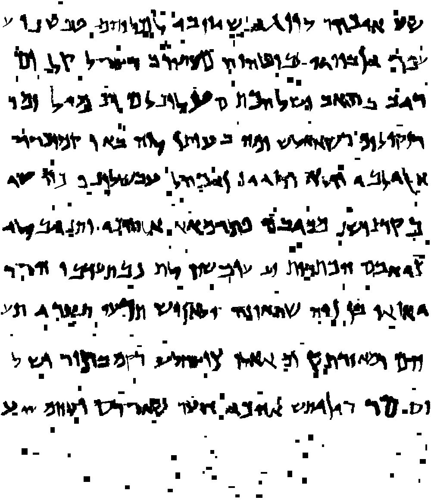
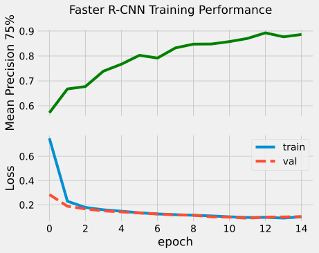

# Handwriting Recognition Project

Here I show my project for the Handriting Recognition course in my masters program. The source code is available on [GitHub](https://github.com/i4ata/HWR2) and all results can be reproduced by running it.

## Introduction & Problem Definition

We are tasked with transcribing scans of pages taken from the popular [Dead Sea Scrolls](https://en.wikipedia.org/wiki/Dead_Sea_Scrolls). It's a huge collection of religious handwritten scripts written in ancient Hebrew. It is one of the oldest examples of handwritten text. They contain information of enormous historical significance, such as details on how life was back then as well as historical events. However, automatically transcribing them has shown to be quite difficult due to the poor quality of the documents (written on parchment 2 thousand years ago). We were given 20 binary scans of images with varying quality:

Example 1 | Example 2 | Example 3
:--------:|:---------:|:--------:
 |  | 

It is now maybe a good time to mention that I do not know any Hebrew and that is not a requirement for this project. We were also provided with 5537 labeled images of individual handwritten characters, roughly equally distributed between the 27 Hebrew characters. The following are some examples of the character Alef:

Example 1 | Example 2 | Example 3
:--------:|:---------:|:--------:
 |  | 

Also, we are given a CSV file with 6060 Hebrew n-grams (sequences of $n$ letters) and their relative frequencies. For instance, the most popular n-gram is the combination 'Alef-Lamed'. Lastly, we are given instructions and a python script for generating Hebrew characters by simply writing them on a white canvas using the  font. It is considered to be the font most similar to the dead sea scrolls. It seemed that the intended approach for tackling the problem would be to split in two stages:

1. Extract the lines and characters from the original images.
2. Classify each extraction by training a classifier using the provided data.

## Approach

Computer vision tasks have recently shown to be most successful when the pipelines are fully end-to-end and no human bias is added. For example, Convolutional Neural Networks (CNNs) combine the feature extraction and classification steps in one, thereby allowing the two stages the learn together. As a result the inputs and outputs of the CNN are the raw images and the predicted classes, making them entirely end-to-end. Previous approaches frequently include handcrafting features and using them as inputs to the model.

I took the modern approach and designed a pipeline with the aim of *detecting* the individual characters directly from the input image. This refers to the task of [Object Detection](https://en.wikipedia.org/wiki/Object_detection), where the aim is to predict the location of an object in the image (i.e. a bounding box) as well as its class (e.g., human, car, airplane, etc.).  Object-detection is a classical example of multi-task learning, where a model is trained on multiple tasks (in this case bounding box regression as well as classification) from the same data. This has shown to be very effective in machine learning compared to an independent model for each task as the tasks are usually connected so improving in one task usually means improving in the other. This is an example of an object detector prediction on an image:


There are tons of freely available pretrained models online such as the state-of-the-art [YOLO](https://docs.ultralytics.com/) or the [torchvision](https://docs.pytorch.org/vision/stable/index.html) models library. Why not use them to detect handwritten characters? The main issue is the data. The 20 test images that we are tasked to transcribe have no associated labels with them whatsoever. Even if they were labeled, 20 is way too few to fine tune a reliable object detector. After all, a deep learning model is only as good as the data it is trained on is. Therefore, I decided to generate my own labeled data.

### Data Generation

Thankfully, everything needed to generate artificial scrolls is available, namely, a lot of images of labeled characters as well as the n-grams. Firstly, I start with processing the individual characters. As it can be seen from above, the character images are quite imperfect, there are many artifacts and the character itself does not seem to stretch to the edges of its image. However, pixel-perfect bounding boxes are desired for proper training. To ensure that is the case, I do the following:

1. Binarize the image and invert it (such that it's white on black instead of black on white)
2. Pad it a little bit with 0s along all edges
3. Extract the 'connected components'. The image can be represented as a graph where the nodes are the pixels. There is an edge between two pixels if they are neighobring and are of the same color (i.e. black or white). Then, we can simply extract the sets of pixels that define connected components. The intuition is that the *second largest* component is the character (the first one being the background, all others are artifacts). The reasoning for the padding is to:
    1. Ensure that the background is connected
    2. Ensure that the background is the largest connected component (since we are adding a bunch of 0s, which is the color of the background)
4. Extract the second largest connected component and crop the image such that the edge perfectly encapsulates it. This is done by removing all fully white columns or rows as they do not contain the character.

The steps can be visualized as follows:

Image | Inverted | Padded | Components | 2nd largest | Cropped
:----:|:--------:|:------:|:----------:|:-----------:|:------:
 |  |  |  |  | 

<!-- code -->

```python
def _process_image(img: np.ndarray, pad_width: int) -> np.ndarray:
    
    # Binarize & invert
    img = 1 - (img > 127).astype(np.uint8)

    # Pad
    img = np.pad(img, pad_width=pad_width, mode='constant', constant_values=0)
    
    # Get the connected components map
    n, components = cv.connectedComponents(img)

    # Get the second largest connected component (this will be the characte4)
    k = np.argsort(np.unique(components, return_counts=True)[1])[-2]

    # Reverse the padding
    img = components[
        pad_width : components.shape[0]-pad_width, 
        pad_width : components.shape[1]-pad_width
    ]

    # Value is 1 only if the pixel is NOT the second largest component (white, background)
    img = img != k

    # Crop further to ensure that the image borders perfectly encapsulate the character
    img = img[~img.all(1)][:, ~img.all(0)]

    return img
```

<!-- code -->

By manually checking, it seems that this method works every time for the data at hand. Now that we have many images of characters, we can just draw them on a white canvas, similarly to original scrolls! The first step is to choose which character to draw. To still generate somewhat realistic text without knowing a word of Hebrew, I rely on the n-grams. Basically, I sample a sequence of n-grams and store each letter in a LIFO queue. The next character is simply "popped" from the queue. If the queue is empty, I just sample another sequence and enqueue it. To make the text reflect the frequencies of the n-grams, each n-gram is sampled with a probability proportional to its frequency.

<!-- code -->

```python
class CharacterFetcher:

    def __init__(self) -> None:
        
        # Read the ngrams
        self.ngrams_df = pd.read_csv(os.path.join('resources', 'ngrams_frequencies_withNames.csv'))
        
        # Create a LIFO queue for the characters that are sampled as entire ngrams
        self.queue: List[str] = []

    def sample(self) -> str:

        # If we have characters in the queue, priorizite emptying it
        if self.queue:
            return self.queue.pop(0)
        
        # Sample an entire n-gram with a probability proportional to its frequency
        ngram: str = self.ngrams_df['Names'].sample(weights=self.ngrams_df['Frequencies']).iloc[0]
        ngram = ngram.replace('Tsadi', 'Tsadi-medial').replace('Tasdi-final', 'Tsadi-final')
        self.queue.extend(ngram.split('_'))
        
        # Return the first character
        return self.queue.pop(0)
```

<!-- code -->

Next, we need to get an image of the selected character. To add diversity, I use small rotations, shears, dilations, erosions, and scalings of each sampled image at random, analogically to data augmentation. Moreover, each character has a 10% chance to just be the Habakkuk font version of it.

<!-- code -->

To add this to `CharacterFetcher`, we can simply expand the constructor to include the transformation and add functionality to retrieve the images:

```python
class CharacterFetcher:

    def __init__(self, *, transform_args: Dict[str, Dict[str, Any]], p: float, random_state: Optional[int]) -> None:
        ...
        
        # Get the character names
        with open(os.path.join('resources', 'chars.txt')) as f:
            self.chars = [char.rstrip() for char in f]
        
        # Set up the paths
        self.font_paths = {char: os.path.join('resources', 'habbakuk_characters', f'{char}.npy') for char in self.chars}
        self.dataset_paths = {char: glob(os.path.join('resources', 'processed_characters', f'{char}/*.npy')) for char in self.chars}

        # Set up the transformation
        transform_fs = {
            'rotate': partial(A.Rotate, interpolation=cv.INTER_NEAREST, fill=255),
            'affine': partial(A.Affine, fill=255),
            'dilate': partial(A.Morphological, operation='dilation'),
            'erode': partial(A.Morphological, operation='erosion'),
            'scale': partial(A.RandomScale, interpolation=cv.INTER_NEAREST)
        }
        self.transform = A.Compose([transform_fs[t](**transform_args[t]) for t in transform_args], seed=random_state, p=p)
        
    def get_random_char(self, *, p: float, transform: bool) -> Tuple[str, np.ndarray]:
        
        # Get a random character
        char = self.sample()

        # Get the image of it
        image_path = rd.choice(self.dataset_paths[char]) if rd.random() > p else self.font_paths[char]
        image = np.load(image_path)

        if not transform: return char, image

        # Apply transformation
        return char, self.transform(image=image.astype(np.uint8))['image'].astype(bool)
```

Here, the `transform_args` as well as any other parameters are passed from a config file, where the corresponding section looks as follows:

```yaml
  # Params for the individual character images data augmentation
  transform:
    p: 1.0

    # options: {rotate, shear, dilate, erode, scale}
    transform_args:

      rotate: 
        limit: 15
        p: 0.5
      
      affine: 
        shear: [-10, 10]
        p: 0.5

      dilate: 
        scale: 3
        p: 0.5

      scale: 
        scale_limit: 0.15
        p: 0.5
```

<!-- code -->

Now that we can generate text and images of characters, we can simply paste these images on empty lines, and arrange these lines in a page, which would hopefully resemble the Dead Sea Scrolls. 

<!-- code -->

Let us first look at how to draw on a line:

```python
class ScrollGenerator:

    def __init__(self, random_state: Optional[int], **fetcher_kwargs) -> None:
        
        np.random.seed(random_state)
        rd.seed(random_state)
        self.character_fetcher = CharacterFetcher(random_state=random_state, **fetcher_kwargs)

    def generate_line(
        self, *,
        line_height: int,
        line_width: int,
        max_offset_from_line_center: int,
        max_offset_from_right_side: int,
        word_length_range: Tuple[int, int],
        spacing_scale: float,
        min_space: int,
        overlap_range: Tuple[int, int],
        transform: bool,
        p_font: float
    ):
    ...
```

All parameters will be introduced shortly. We first start with an empty white line (represented as a binary array, 1=white). Then we can define 2 empty lists to store the coordinates of the bounding boxes as well as the text:

```python
        # Initialize the "canvas"
        line = np.ones((line_height, line_width), dtype=bool)
        boxes, text = [], []
```

Hebrew reads from right to left. We need to first define the starting point of the text on the line. To add randomness, the offset from the right edge of the line is randomized:

```python
        # Start from the right edge for right-to-left writing
        x = line_width - rd.randint(0, max_offset_from_right_side)
```

Then, we can iteratively draw the characters until there is space on the line:

```python
        # Draw until there is space
        while True:
```

Firstly, we generate a "word", i.e. a random sequence of characters and their corresponding images:

```python
            # Generate a word
            word = [self.character_fetcher.get_random_char(transform=transform, p=p_font) for _ in range(rd.randint(*word_length_range))]
```

Then, we can loop over the characters in the word and draw them one by one:

```python
            # Reverse the word for right-to-left writing
            for char, char_img in reversed(word):
                h, w = char_img.shape
```

Here `w` and `h` are the width and height of the character image respectively. We begin with our terminal case. We must stop drawing characters if the next one cannot fully fit on the line:

```python
                # Check if the current character fits in the remaining line width
                if x - w <= 0:
                    return line, np.array(boxes), text
```

If it does not fit, we can simply return the current state of the line image together with the characters' bounding boxes and the written text.

The character's vetical location is computed such that the middle of the line splits the character image in half. To add randomness, we can add a small random offset to the middle of the line as follows:

```python
                # Get the y-coordinate of the word
                y = line_height_middle - h // 2
                max_offset = min(y - 1, max_offset_from_line_center)  # ensure that the character will fit on the line
                y += rd.randint(-max_offset, max_offset)
```

Here `line_height_middle` is a variable defined at the beginning of the function as `line_height_middle = line_height // 2`. Now that we know where the character should go, we can simply "draw" it. Here, drawing entails taking the logical AND of the character and the line. Since the line is 1s and the character is 0s (black) on a background of 1s (white), the logical AND between them simply leaves the character on the line. Here it is important to not simply overwrite the line because another character might be present in the bounding box of the current one (overwriting will erase the other character, while the logical AND would keep all additional 0s). This happens when the distance between 2 characters in negative, i.e., they are overlapping, which is quite common in handwritten text. In Python, we can simply draw the character as follows:

```python
                # Add the character to the image
                line[y:y + h, x - w:x] &= char_img

                # Save the bounding box and character
                boxes.append([x - w, y, w, h])
                text.append(char)
```

Now we only need to calculate the distance between that character and the next one. To add randomness, it is random and, as previously mentioned, it can be negative:

```python
                # Update the x position for the next character
                spacing = int(np.random.exponential(spacing_scale)) - rd.randint(*overlap_range)
                x -= (w + spacing)

```

Finally, after we are done generating the current word, we can add more space between it and the next one and repeat the whole process:

```python
            # Add a space between words
            spacing = max(min_space, int(np.random.exponential(spacing_scale)))
            x -= spacing
```

That's it! Now we have our own artificial lines. 

<!-- code -->

An example line is this:


And the labels:


Now that we have the lines, we can easily stack them on a white canvas.

<!-- code -->

```python
    def generate_sea_scroll(
        self, *,
        lines: int, 
        line_width: int, 
        line_height: int, 
        inter_line_spacing_range: Tuple[int, int], 
        **line_kwargs
    ) -> Tuple[np.ndarray, np.ndarray, List[str]]:

        total_height = lines * (line_height + inter_line_spacing_range[1]) - inter_line_spacing_range[1]
        final_image = np.ones((total_height, line_width), dtype=bool)
        all_boxes, full_text = [], []

        # Keep track of the line on which we are drawing
        current_height = rd.randint(*inter_line_spacing_range)
        for _ in range(lines):
            # Generate a new line
            line, boxes, text = self.generate_line(line_height=line_height, line_width=line_width, **line_kwargs)

            # Add the characters to the text
            full_text.extend(text)

            # Add the boxes by adjusting the y-coordinate such that it is wrt to the whole image
            boxes[:, 1] += current_height
            all_boxes.extend(boxes)

            # Add the line to the image
            final_image[current_height:current_height + line_height] = line

            # Update the position of the line on which we are drawing
            current_height += line_height + rd.randint(*inter_line_spacing_range)

        return final_image, np.array(all_boxes), full_text
```

<!-- code -->

The randomness here is the offset between 2 consecutive lines. Example generated scroll:

Image | Labels
:----:|:-----:
 | 

Looking quite good! Now for a few minutes we can generate 10 000 of these for training and 1 000 for testing, which would be, hopefully, enough to fine tune an object detector. A neat trick to storing that many binary values is to "pack" them. In Numpy, the type of a boolean array is 8-bit unsigned int, meaning that each element takes 1 byte even though it carries 1 bit of information. To save memory, we can compress the array by packing the bits in groups of 8 and representing their value by a single uint8. For example, the sequence `11111111` would need 8 bytes of memory to be stored, however, the same information can be represented as the number `255`, which requires only 1 byte. Therefore, we can effectively store the data using 1/8th of the memory without any losses. In python, we could do it like this:

```python
np.packbits(image, axis=1)
```

where `image` is a binary numpy array. This packs only the image's rows, which can be recovered later with `np.unpackbits`.

One thing is missing though... the generated images seem to be with perfect quality! To account for that, we "corrupt" the images a bit during training using data augmentation. Basically what is done is, between 200 and 400 white rectangles with both dimensions ranging between 4 and 15 pixels are randomly drawn on the image to simulate erased characters. The same is done with black rectangles to simulate other artifacts such as spilled ink. An example:



<!-- code -->

In python, we can do this when sampling from our `torch.utils.data.Dataset` as follows:

```python
class ScrollsDataset(Dataset):

    def __init__(self, *, train: bool, transform_args: Dict[str, Dict[str, Any]], p: float, random_state: Optional[int]) -> None:
        
        super().__init__()

        # Get the paths to the images
        split_path = os.path.join('resources', 'dataset', 'train' if train else 'val')
        self.image_paths = sorted(glob(os.path.join(split_path, 'images', '*.npy')))
        self.targets_paths = sorted(glob(os.path.join(split_path, 'targets', '*.npy')))
        assert len(self.image_paths) == len(self.targets_paths)

        # Define the data augmentation
        # Currently only filling white or black rectangles on top of the image
        transform_fs = {
            'white_coarse_dropout': partial(A.CoarseDropout, fill=1), # 1 = white
            'black_coarse_dropout': partial(A.CoarseDropout, fill=0), # 0 = black
        }
        self.transform = A.Compose([transform_fs[transform](**args) for transform, args in transform_args.items()], seed=random_state, p=p)

    def __getitem__(self, idx: int) -> Tuple[torch.Tensor, torch.Tensor, torch.Tensor]:

        # Get the image from memory
        image = np.load(self.image_paths[idx])
        image = np.unpackbits(image, axis=1)
        image = torch.from_numpy(self.transform(image=image)['image']).float().unsqueeze(0)

        # Get the targets
        targets = torch.from_numpy(np.load(self.targets_paths[idx]))

        # Split boxes and labels
        boxes, labels = targets[:, :4].float(), targets[:, 4].long() + 1  # The +1 makes it so the labels start at 1, with 0 being the background

        # Convert boxes from x1y1wh to xyxy since that is the format of the Faster R CNN
        boxes = box_convert(boxes=boxes, in_fmt='xywh', out_fmt='xyxy')

        return image, boxes, labels
```

Again, the `transform_args` are passed from a config file where that section may look like this:

```yaml
# Data augmentation for the entire images in the datasets
augmentation:
  p: 1.0

  # Options {white_coarse_dropout, black_coarse_dropout}
  transform_args:
  
    white_coarse_dropout:
      num_holes_range: [200, 400]
      hole_height_range: [4, 15]
      hole_width_range: [4, 15]
      p: 1
    
    black_coarse_dropout:
      num_holes_range: [200, 400]
      hole_height_range: [4, 15]
      hole_width_range: [4, 15]
      p: 1
```

<!-- code -->

### Object Detection

Now that we have our data, we can simply fine-tune a pretrained object detector. I settled on [Faster R-CNN from torchvision](https://docs.pytorch.org/vision/main/models/faster_rcnn.html) as it simply worked out of the box. However, there are likely other more appropriate choices especially because the R-CNN expects 3-channel inputs but the scrolls are only black and white, therefore, there is some redundancy.

<!-- code -->

To implement the model, we simply need to download it from torchvision. Then, we can change the number of detections per image as the scrolls contain way more objects (characters) that there usually are in object detection tasks. I set that to 400. Moreover, the input images are also quite a lot bigger than the default. I set the maximum image size to 3000 pixels per dimension. We then naturally need to overwrite the final layer of the network such that the predicted probability distribution for each bounding box is defined over the appropriate number of classes. In Python, this can be set as follows:

```python

import torch
import torch.nn as nn
from torchvision.models.detection import fasterrcnn_resnet50_fpn
from torchvision.models.detection.faster_rcnn import FastRCNNPredictor

from typing import Optional, List, Dict, Union

class ScrollsDetector(nn.Module):

    def __init__(self, *, box_detections_per_img: int, max_size: int, random_state: Optional[int]) -> None:

        super(ScrollsDetector, self).__init__()

        if random_state is not None:
            torch.manual_seed(random_state)
            torch.cuda.manual_seed(random_state)
        
        # Download pretrained weights
        self.fasterrcnn = fasterrcnn_resnet50_fpn(
            weights='DEFAULT',
            box_detections_per_img=box_detections_per_img,
            max_size=max_size
        )

        # Overwrite the head
        self.fasterrcnn.roi_heads.box_predictor = FastRCNNPredictor(
            in_channels=self.fasterrcnn.roi_heads.box_predictor.cls_score.in_features,
            num_classes=28  # 27 characters + background
        )

        self.train()
```

Now we also need to overwrite the model's `forward` method, which defines the forward pass. In training mode, the `forward` method takes both the inputs and the ground truth labels (i.e. the boxes and the classes) and outputs the losses. In evaluation mode, the method takes only the images and outputs the predicted bounding boxes and classes. This is simply integrated as follows:

```python
    def forward(
        self,
        images: Union[torch.Tensor, List[torch.Tensor]],
        boxes: Optional[List[torch.Tensor]] = None,
        labels: Optional[List[torch.Tensor]] = None
    ) -> Dict[str, torch.Tensor]:
        
        # We are in inference mode
        if boxes is None:
            return self.fasterrcnn(images)

        # Convert the targets to the format of the model
        targets = [{'boxes': b, 'labels': l} for (b, l) in zip(boxes, labels)]

        # Pass to the Faster R-CNN
        losses = self.fasterrcnn(images, targets)

        return losses
```

Finally, the model's predictions are postprocessed using non-maximum suppression as follows:

```python
    from torchvision.ops import nms
    def postprocess(self, detections: List[Dict[Literal['boxes', 'scores', 'labels'], torch.Tensor]]) -> List[Dict[str, torch.Tensor]]:
        
        return [
            {key: d[key][indices] for key in d}
            for (d, indices) in
            zip(
                detections,
                [nms(boxes=d['boxes'], scores=d['scores'], iou_threshold=self.nms_iou_threshold) for d in detections]
            )
        ]
```

This entails that if 2 bounding boxes have an Intersection over Union of at least `self.nms_iou_threshold` (set to 0.4), then only the box with the larger "objectness score" (i.e. predicted confidence) is kept. The intersection over union for two bounding boxes resembles the level of overlap between them. It is formally defined as the number of pixels that are inside both boxes divided by the number of pixels inside either box. If the IoU is 1, the boxes are the same, if it is 0, the boxes are not overlapping at all. That's it! Now we are ready to train!

<!-- code -->

## Results

To evaluate the model, I use Mean Precision for IoU of 75% It is calculated as follows:

1. Loop over all classes $i$.
2. Consider only the ground truths and predictions for label $i$.
3. If a ground truth and a predictoin have an IoU larger than 75%, count this as a true positive.
4. The precision for $i$ is defined as the proportion of true positives over all predicted boxes.
5. The mean precision is the averaged precision over all classes $i$.

The higher the mean precision is, the better, with a maximum of 1. The model is trained on the generated 10 000 samples for a maximum of 20 epochs with early stopping, that is, the training terminates if the validation loss has not improved for a predefined number of epochs. This is done to stop overfitting. The details about the training as well as the source code can be found on GitHub. I made use of my university's remote cluster [Hábrók](https://wiki.hpc.rug.nl/habrok/start), which provides GPUs and SSDs for efficient training. The model has been logged with Mlflow and can be served on the cluster! However, that is not practical as the cluster is only for internal use and the demand for its GPUs is way too large for reserving one just for this model. If you want to try predictions with the model, you can train it yourself by running the code!

The training went as follows:



It can be seen that the model performs incredibly good, reaching mean precision of 0.9! Let us look at some example predictions on a synthetic image:

Image | Ground Truth | Predictions | Both
:----:|:------------:|:-----------:|:---:
 |  |  | 

It seems that the majority of the characters are successfully detected and none of the artifacts seem to be misclassified. Now we can see how good the method is for the real images:

Image | Predictions
:----:|:----------:
 | 

It again seems to be doing great! Maybe it generalizes well? Looking at the more corrupted images shows otherwise:

Image | Predictions
:----:|:----------:
 | 

There are multiple false positives.. It is likely that the model would need to see more severly corrupted images and other formats. Still, the results so far are quite promising! Also, it would be very useful to develop a reliable way to convert the predictions into text. This proves to be quite difficult as the bounding boxes are not naturally structured into lines.
