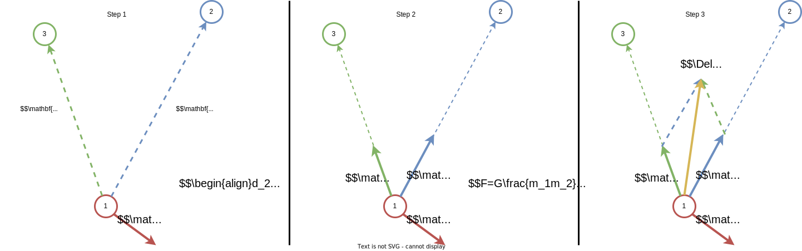

# N-Body Problem

In this project I implement the $N$-body problem. It studies the trajectories of $N$ celestial bodies over time that interact with each other only with gravitational forces. It is a notoriously difficult problem since there exist no analytical solution for $N>2$. That is, it is impossible to define a function that takes the system's initial conditions (i.e. the positions and velocities of the bodies at time $t_0$) and some time $t>t_0$ in the future, which returns the positions and velocities of the bodies at time $t$. The only *somewhat* reliable way to tackle this problem is to iteratively compute the changes in the simulation for each timestep $\Delta t$. I say *somewhat* due to 2 distinct yet related reasons.

1. The simulation is realistic only when $\Delta t\to 0$. Naturally, this requires that the simulation runs for infinitely many iterations in order to obtain its state for any time in the future $t>t_0$.

2. The simulation is realistic only when the positions and velocities are calculated using arbitrary precision, which is unfeasible for computers.

Nature is difficult to simulate due to the above mentioned reasons. Moreover, the problem is chaotic, meaning that tiny changes in the present result in enormous deviations in the future. Therefore, in theory, my (and every other digital) simulation is *infinitely incorrect*.

Each body is fully described at time $t$ by its position $\mathbf{x}(t)=(x,y,z)$, its velocity $\mathbf{v}(t)=(v_x,v_y,v_z)$, and its constant mass $m$. The position and velocity of each body is updated using Euler's method, which is very straightforward. It uses the intuition that the velocity of an object is the derivative of its position and its acceleration is the derivative of its velocity. The update rule is as follows:

$$
\begin{align*}
& \mathbf{x}(t+\Delta t)_i=\mathbf{x}(t)_i+\mathbf{v}(t)_i\Delta t,\quad i = 1,2,\ldots,N\\
& \mathbf{v}(t+\Delta t)_i=\mathbf{v}(t)_i+\mathbf{a}(t)_i\Delta t,\quad i = 1,2,\ldots,N
\end{align*}
$$

Here $\mathbf{a}(t)_i$ is the acceleration of body $i$ at time $t$ and it specifies the change of velocity in each cardinal direction. 

## Euler Integration

In code, the update rule is simply done as follows:

```python
def run_euler(
    b: int = 1, 
    n: int = 3, 
    d: Literal[2,3] = 2,
    init_position: Optional[np.ndarray] = None,
    init_velocity: Optional[np.ndarray] = None,
    M: Optional[np.ndarray] = None,
    step: float = .005, 
    max_t: int = 1_000,
    G: float = 1,
    max_magnitude: float = 15
) -> Tuple[np.ndarray, np.ndarray, np.ndarray]:

    # [b, t, n, d] -> [simulation id, timestep, body id, dimension id]
    x, v, a = np.zeros((3, b, max_t, n, d))
    x[:, 0] = np.random.rand(n, d) * 2 - 1 if init_position is None else init_position
    v[:, 0] = np.random.rand(n, d) * 2 - 1 if init_velocity is None else init_velocity

    # Body masses
    M = np.ones((n, 1)) if M is None else M[:, np.newaxis]
    
    # Loop over time
    for t in tqdm(range(max_t - 1)):

        # Euler's integration step
        a[:, t] = _compute_acceleration(x[:, t], M=M, G=G, max_magnitude=max_magnitude)
        x[:, t+1] = x[:, t] + v[:, t] * step
        v[:, t+1] = v[:, t] + a[:, t] * step
        
    return x.squeeze(0), v.squeeze(0), a.squeeze(0)
```

The inputs to the function `run_euler` are:

- `b`: The batch size $B$. It denotes the number of simulations that can run in parallel. The requirements are that all simulations run for the same amount of time with the same step size $\Delta t$, have the same number of celestial bodies $N$, and exist in the same number of dimensions (either 2D, where all bodies lie on a plane, or 3D).
- `n`: The number of celestial bodies $N$.
- `d`: The number of dimensions $D$ (either 2 or 3). (However, the simulation would work in arbitrary dimensions, assuming that gravitational laws remain the same)
- `init_position`: Optionally, define the initial positions of the bodies $\mathbf{x}(t_0)$ (either $B\times N\times D$ or $N\times D$). If not specified, each coordinate is samples from $U(-1,1)$.
- `init_velocity`: Also, optionally, define the initial velocities of the bodies $\mathbf{v}(t_0)$ (either $B\times N\times D$ or $N\times D$). If not specified, each coordinate is, again, samples from $U(-1,1)$.
- `M`: Optionally, define the bodies' masses ($B\times N$ or $N$). If not specified, each body has a mass $1$.
- `step`: The value of $\Delta t$.
- `max_t`: The total number of steps in the simluation
- `G`: Newton's gravitational constant (comes later)
- `max_magnitude`: The maximum acceleration magnitude allowed in the simulation

The code makes use of vecotirzed operations on arrays in Numpy to efficiently run many simulations in parallel. 

## Acceleration Computation

The key of the simulations is calculating the accelerations $\mathbf{a}(t)$, which is done with the function `_compute_acceleration`, called in the code snippet above. To find them, we use Newton's law of universal gravitation, which states that the gravitational force applied to 2 bodies with respect to each other is defined as:

$$
F=G\frac{m_1m_2}{d^2}
$$

Here $m_1$ and $m_2$ are the masses of the two bodies, $G$ is the gravitational constant, and $d$ is the distance between the bodies. Now we can find the accelerations at each step as follows:

```python
def _compute_acceleration(
    x: np.ndarray, 
    M: np.ndarray, 
    G: float = 1, 
    max_magnitude: float = 15
) -> np.ndarray:
```

The inputs are:
- `x`: $B\times N\times D$ array. $\mathbf{x}_{ijk}$ represents the current $k$-th coordinate of the $j$-th body in the $i$-th parallel simulation.
- `M`: $B\times N$ array, defining the masses $m_i$ of each of the $N$ bodies.
- `G`: The Newton gravitation constant.

We can follow this illustrative diagram, which shows how the acceleration for body 1 is calculated in a 3 body system:



### Step 1

We find all vectors $\mathbf{x}(t)_i-\mathbf{x}(t)_j,i=1,2,\ldots,N,j=1,2,\ldots,N$ and their respective magnitudes $d_{ij}$.

```python
    # [B, N, N, D]
    directions = x[:, np.newaxis] - x[:, :, np.newaxis]
    
    # [B, N, N, 1]
    distances: np.ndarray = np.linalg.norm(directions, axis=3, keepdims=True)
```

Here `directions` is a $B\times N\times N\times D$ array such that $\text{directions}_{ijk}$ represents the difference in positions of body $j$ and body $k$, in simulation $i$. The array `distances` is of shape $B\times N\times N\times 1$ and it contains the magnitudes of the vectors, i.e. $d_{ij}=||\mathbf{x}_i-\mathbf{x}_j||$.

### Step 2

Compute the forces $F$ that each body applies to each other body. Since $F$ is a scalar but the acceleration is a vector, we use the fact that the bodies pull towards themselves, therefore, the force, with which body $i$ pulls body $j$ is applied along the vector $\mathbf{x}_i-\mathbf{x}_j$. We can simply ensure that the magnitudes of the acceleration are equal to the forces $F$ by first normalizing the vectors $\mathbf{x}_j-\mathbf{x}_i$ and then multiplying them by $F$. This is done as follows:

```python
    # [B, N, N, 1]
    masses = (M[:, np.newaxis] * M[:, np.newaxis])[:, :, :, np.newaxis]
    
    # [B, N, N, D]
    pairwise_accelerations = directions * masses * G / distances ** 3
```

Here `masses` is a $B\times N\times N\times 1$ array, where $\text{masses}_{ijk}$ represents the product of the masses of bodies $j$ and $k$ in simulation $i$ namely $m_jm_k$.
`pairwise_accelerations` is a $B\times N\times N\times D$ array, where $\text{accelerations}_{ijk}$ represents the acceleration of body $j$ towards body $k$ in each cardinal direction in simulation $i$.

### Step 3

Sum all accelerations for each body towards each other body to obtain the total accelerations. This is done as follows:

$$
\mathbf{a}(t)_i=\sum_{j=1}^N\begin{cases}\mathbf{a}_{ij} & \text{if }i\neq j\\0&\text{otherwise}\end{cases}
$$

Where $\mathbf{a}_{ij}$ is the acceleration of body $i$ towards body $j$. The body's acceleration towards itself is 0, therefore, its computation is skipped. That way we also skip dividing by 0 in the equation for the gravitational force sicne $d_{ii}=0$. In code this is done as follows:

```python
accelerations = np.nansum(pairwise_accelerations, axis=2)
```

In NumPy if we divide by 0, we get `nan`. Therefore, we can simply use the `nansum`, which appropriately treats each `nan` as a 0. The resulting array `accelerations` is of shape $B\times N\times D$ and the $(i,j)$-th component is the acceleration of body $j$ in simulation $i$ for each cardinal direction, which is what we want. That's it!

```python
    return accelerations
```

### Extra (Step 4)

It is possible that bodies get arbitrarily close to each other and it can be seen that:

$$
\lim_{d\to0}F=\infty
$$

which causes the bodies to shoot out very far from each other and stop interacting at all. To optionally circumvent that and get nicer visuals, we can bound the magnitudes of the accelerations as follows:

```python
def _clamp_magnitude(a: np.ndarray, max_magnitude: float = 15) -> np.ndarray:
    
    # [b, n]
    # Compute the acceleration magnitudes for each body
    magnitudes: np.ndarray = np.linalg.norm(a, axis=-1)
    
    # Wherever the acceleration is larger than the maximum magnitude, clamp it
    # by first normalizing it and then multiplying by the maximum magnitude
    large = magnitudes > max_magnitude
    a[large] *= max_magnitude / magnitudes[large][..., np.newaxis]
    
    return a
```

Here the input `a` is the accelerations calculated from before, and the `max_magnitude` parameter defines the upper bound of the acceleration magnitudes. Intuitively, we set the magnitude of each acceleration $\mathbf{a}(t)_i$ to $\min(||\mathbf{a}(t)_i||,\text{max\_magnitude})$

Overall, this way of calculating the accelerations makes use of NumPy vectorized operations to efficiently process a batch of $B$ systems with an arbitrary number of bodies $N$ and arbitrary number of dimensions $D$. As a benchmark, on my PC, 3D trajectories of a 100-body system for 5000 steps are calculated in 2 seconds. The operations can also greatly benefit from using GPUs.

## Interaction

Explore some trajectories with the following interaction!
