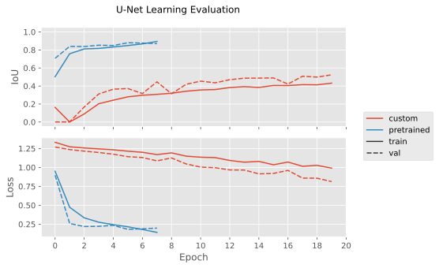

# U-Net

In this project I implement the [U-Net architecture](https://arxiv.org/abs/1505.04597) and compare it to a pretrained model from [PyTorch Segmentation Models](https://segmentation-modelspytorch.readthedocs.io/en/latest/). The entire source code, which enables reproducing the results can be found on [Github](https://github.com/i4ata/UnetSegmentation).

The U-Net is designed for semantic segmentation. It is a computer vision task where the goal is to assign a class to each pixel in the input image. Therefore, for an input image of shape $(C\times H\times W)$ with number of channels $C$, height $H$, and width $W$, the output is a probability distribution over the $D$ classes for each pixel, i.e. a tensor of shape $(D\times H\times W)$. I use labeled training images with 2 classes: a person or not a person, which can be found [here](https://github.com/parth1620/Human-Segmentation-Dataset-master.git).

## Preliminaries

The main component of the model is the convolutional layer. Convolution is a linear operation applied to entire images with the goal of feature extraction. In the most general case, each layer is parameterized by a learnable weights tensor $W$ with shape $(C_{\mathrm{out}}\times C_{\mathrm{in}}\times K\times K)$, where $K$ is odd. The input is an image $X$ with $C_{\mathrm{in}}$ channels and the output is a feature map $Y$ with $C_{\mathrm{out}}$ channels and (usually) the same spatial dimensions. The other parameter of the model is a bias vector $b$ with $C_\mathrm{out}$ elements. The output $Y$ is calculated as follows:

$$
y_{oij}=b_o + \sum_{c=1}^{C_{\mathrm{in}}}\sum_{u=1}^{K}\sum_{v=1}^{K}\mathrm{patch}_{cuv}w_{ocuv}
$$

Here $\mathrm{patch}$ is the $K\times K$ square from the image centered at $(i,j)$. To ensure that the output feature map has the same spatial dimensions as the input, the input image is commonly padded by adding $(K-1)/2$ rows and columns of zeros on each side. Note that the convolution operation is independent of the image's spatial dimensions $H$ and $W$, meaning that the layer can handle inputs of different sizes.

In PyTorch, the convolutional layer can be implemented as follows:

```python
import torch
import torch.nn as nn
from torch.nn.functional import pad

class Conv2dManual(nn.Module):
    
    def __init__(self, in_channels: int, out_channels: int, kernel_size: int = 3) -> None:
        
        super(Conv2dManual, self).__init__()
        self.k = kernel_size
        self.in_channels = in_channels
        self.out_channels = out_channels
        self.weight = nn.Parameter(torch.randn(out_channels, in_channels, self.k, self.k))
        self.bias = nn.Parameter(torch.randn(out_channels))
```

Now we can implement the forward pass:

```python
    def forward(self, x: torch.Tensor) -> torch.Tensor:

        n, c, h, w = x.shape
        out = torch.zeros(n, self.out_channels, h, w)
        
        # Pad the image by adding rows and columns of 0s on each side
        x = pad(x, [self.k // 2] * 4)

        # Move the kernel down
        for i in range(h):

            # Move the kernel to the right
            for j in range(w):

                # Apply the equation
                patch = x[:, :, i:i+self.k, j:j+self.k]
                out[:, :, i, j] = torch.einsum('bcuv,ocuv->bo', patch, self.weight)
        
        # Add the bias
        out += self.bias.view(1, -1, 1, 1)
        
        return out
```

Here we can conveniently extract the correct patch after padding using the ranges $i:i+k$ and $j:j+k$. Then, we can almost perfectly translate the indices from the equation into `torch.einsum` and perform the desired operation. The bias is added at the very end.
Since convolution is a linear operation, it is commonly followed by a non-linear function such as ReLU.

Convolutions are also accompanied by $\mathrm{MaxPool}$ layers that effectively downsample the image by selecting the largest value in each $K\times K$ patch within each channel. For $K=2$, the image height and widthare both halved. In Python this can be implemented as follows for a $(B\times C\times H\times W)$ tensor `x`:

```python
n, c, h, w = x.shape
x_max_pool = x.reshape(n, c, h // 2, 2, w // 2, 2).amax((3, 5))
```

The other important element of the U-Net is the transposed convolutional layer, which performs the opposite operation. It is parameterized by a learnable weight tensor $W$ with shape $(C_{\mathrm{in}}\times C_{\mathrm{out}}\times K\times K)$ and bias vector $b$ with $C_\mathrm{out}$ elements. Similarly to the convolutional layer, the input is an image with $C_{\mathrm{in}}$ and the output is a feature map with $C_{\mathrm{out}}$ channels. In the U-Net, the layer is used to upscale a feature map by reducing the number of channels and doubling both spatial dimensions. The output $Y$ is calculated as follows:

$$
y_{\mathrm{patch}_{oij}}=b_o + \sum_{c=1}^{C_{\mathrm{in}}}x_{cij}w_{co}
$$

Here, the output is created patch by patch where $\mathrm{patch}_{ij}$ is the $K\times K$ patch at position $(i,j)$. Intuitively, the resulting feature map will be $K$ times expanded in height and $K$ times in width.

In PyTorch, the transposed convolutional layer can be implemented as follows:

```python
class ConvTranspose2dManual(nn.Module):
    
    def __init__(self, in_channels: int, out_channels: int, scale: int = 2) -> None:

        super(ConvTranspose2dManual, self).__init__()
        self.s = scale
        self.in_channels = in_channels
        self.out_channels = out_channels
        self.weight = nn.Parameter(torch.rand(in_channels, out_channels, self.s, self.s))
        self.bias = nn.Parameter(torch.randn(out_channels))
```

Now we can implement the forward pass:

```python
    def forward(self, x: torch.Tensor) -> torch.Tensor:

        n, c, h, w = x.shape
        h_, w_ = h * self.s, w * self.s # Output dimensions
        out = torch.zeros(n, self.out_channels, h_, w_)

        # Moved the kernel down
        for i in range(h):

            # Moved the kernel to the right
            for j in range(w):

                # Apply the equation
                i_, j_ = i * self.s, j * self.s
                out[:, :, i_:i_+self.s, j_:j_+self.s] = torch.einsum('bc,coij->boij', x[:, :, i, j], self.weight)
        
        # Add the bias
        out += self.bias.view(1, -1, 1, 1)

        return out
```

## Architecture

The general architecture proposed in the original paper is as follows:


The network consists of an encoder and a decoder. The encoder is a series of convolutional layers which process the image and produce high dimensional feature maps. The layers are interspersed with pooling layers that downsample the image. The decoder is then used to upsample the image and reconstruct its original dimensions. The key property of the U-Net is that it concatenates feature maps from opposing encoder and decoder layers. That way the network can preserve more of the spatial information and establish residual connections that improve the flow of gradients. In my project I use padded convolutions, thereby the output of each convolutional layer has the same height and width as the input. That way the feature maps in opposing encoder and decoder layers have the same shape, therefore, cropping the feature maps before concatenation is not required. The final output of the model is a probability distribution over the classes for each pixel in the input image. Since we have only one class, for an input image of shape $H\times W \times 3$, the output is a $H\times W$ matrix with values in the range $[0,1]$, representing the probability of a person being in each pixel. Since each layer in the U-Net is a convolutional layer, the model can handle images with various dimensions.

The loss of the model is a combination of the Binary Cross Entropy loss and the Dice loss. BCE is used since we are doing binary classification for each pixel, while the Dice loss accounts for the intersection over union between the predicted mask and the ground truth. In code the loss is defined as follows:

```python
import torch
import torch.nn as nn
from segmentation_models_pytorch.losses import DiceLoss

class UnetLoss(nn.Module):
    """The loss for the model: BCE + Dice"""

    def __init__(self) -> None:
        super(UnetLoss, self).__init__()
        self.bce_loss = nn.BCEWithLogitsLoss()
        self.dice_loss = DiceLoss(mode='binary')

    def forward(self, logits: torch.Tensor, masks: torch.Tensor) -> torch.Tensor:
        return self.bce_loss(logits, masks) + self.dice_loss(logits, masks)
```

The fundamental component of the U-net is the sequence $3\times 3\text{ Conv}\to\text{ReLU}\to3\times 3\text{ Conv}\to\text{ReLU}$, defined by 2 blue arrows after one another in the illustration above. In code this can be simply written as follows:

```python
class DoubleConv(nn.Module):
    """(3x3) conv -> ReLU -> (3x3) conv -> ReLU"""

    def __init__(self, in_channels: int, out_channels: int) -> None:
        
        super().__init__()
        self.conv1 = nn.Conv2d(in_channels, out_channels, kernel_size=3, padding='same')
        self.conv2 = nn.Conv2d(out_channels, out_channels, kernel_size=3, padding='same')
    
    def forward(self, x: torch.Tensor):
        return F.relu(self.conv2(F.relu(self.conv1(x))))
```

Here I am using the built-in convolutional layers for efficiency as they are optimized for GPUs, even though they are equivalent to my implementations presented above. Essentially, the encoder is a sequence of `DoubleConv` modules interspersed with $2\times 2$ max pooling. The decoder layers use transposed convolution (green arrow) and their input is concatenated with the feature map produced by the opposing encoder layer. It can be defined as follows:

```python
class Up(nn.Module):
    """Perform a deconvolution and concatenate with the output of the opposing layer"""

    def __init__(self, in_channels: int, out_channels: int) -> None:

        super().__init__()
        self.upconv = nn.ConvTranspose2d(in_channels=in_channels, out_channels=out_channels, kernel_size=2, stride=2)
        self.conv = DoubleConv(in_channels=in_channels, out_channels=out_channels)

    def forward(self, x_left: torch.Tensor, x_right: torch.Tensor) -> torch.Tensor:
        return self.conv(torch.cat((x_left, self.upconv(x_right)), dim=1))
```

Since the U-Net is a sequence of matching encoding and decoding layers, we can directly write the whole architecture as follows:

```python
class CustomUnet(nn.Module):

    def __init__(self, in_channels: int, depth: int, start_channels: int) -> None:
        
        super().__init__()

        # First layer map to `start_channels`
        self.input_conv = DoubleConv(in_channels, start_channels)

        # Encoder. Double the channels at each layer
        self.encoder_layers = nn.ModuleList()
        for i in range(depth):
            self.encoder_layers.append(DoubleConv(start_channels, start_channels * 2))
            start_channels *= 2
            
        # Decoder. Halve the channels at each layer
        self.decoder_layers = nn.ModuleList()
        for i in range(depth):
            self.decoder_layers.append(Up(start_channels, start_channels // 2))
            start_channels //= 2

        # Final output is a 1:1 convolution. Map to a single channel since we have 1 class
        self.output_conv = nn.Conv2d(start_channels, 1, kernel_size=1)

    def forward(self, x: torch.Tensor) -> torch.Tensor:
        
        x = self.input_conv(x)
        
        # To keep track of the encodings
        xs = [x]

        # Encode the image
        for encoding_layer in self.encoder_layers:
            x = encoding_layer(F.max_pool2d(x, 2)) # Max pool -> red arrow
            xs.append(x) # Store the feature map
            
        # Decode the image while concatenating with the opposing encoder layer at each step
        for decoding_layer, x_left in zip(self.decoder_layers, reversed(xs[:-1])):
            x = decoding_layer(x_left, x)

        # 1:1 convolution into probability distributions over the classes for each pixel
        return self.output_conv(x)
```

Here the filters of each consecutive encoder layer are doubled, while the filters of each decoder layer are halved. 

## Training

During training the mean loss and IoU are measured. The model's training performance compared to a pretrained model is visualized here:



The used parameters are provided in the `params.yaml` on gthub with more information. During training, each image is horizontally flipped with probability of 0.5 and vertically flipped with probability 0.5 to diversify the dataset. Naturally, due to the limited data and random initialization, the custom implementation converges before it stops underfitting, therefore, its performance is poor. On the other hand, the pretrained model appears to learn the data well, reaching around 85% validation IoU. The following shows the predictions of my model and the pretrained one on a random image that both models have never seen:


The custom implementation appears to be doing something right but the pretrained model is pretty good perfect. An interactive demo with both models is shown on [HuggingFace Spaces](https://huggingface.co/spaces/i4ata/CustomUnetSegmentation).
